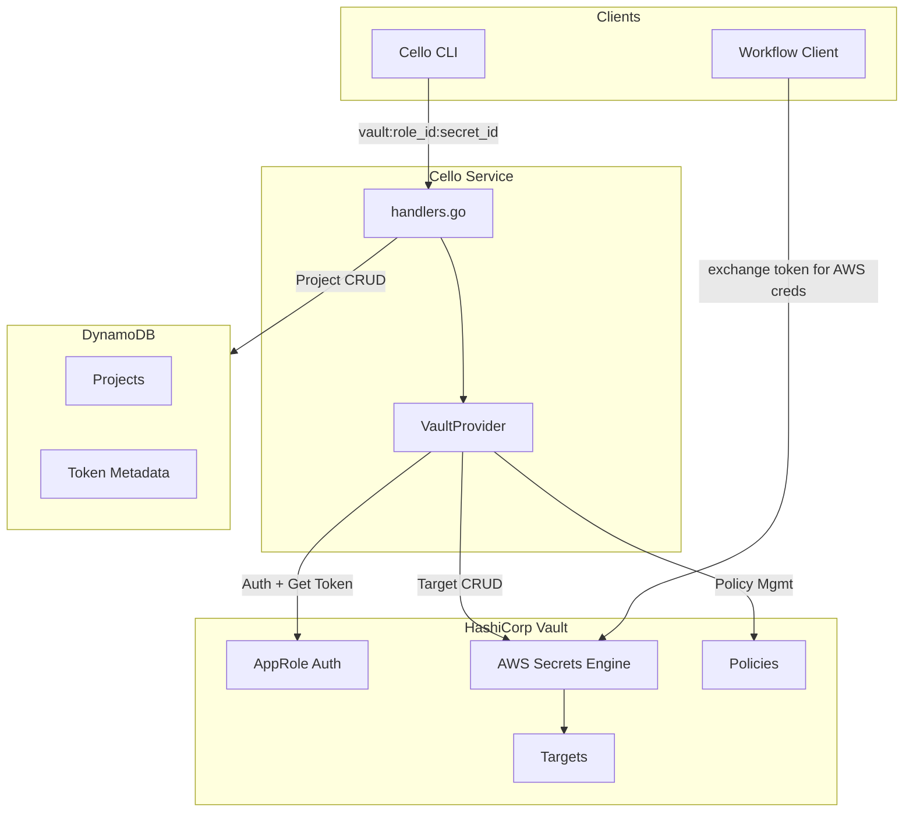
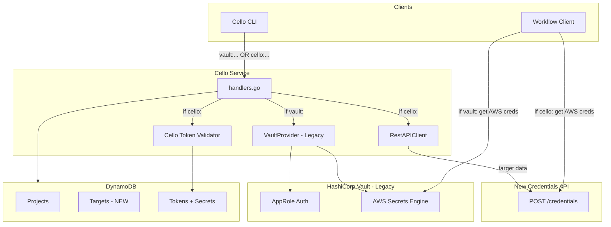
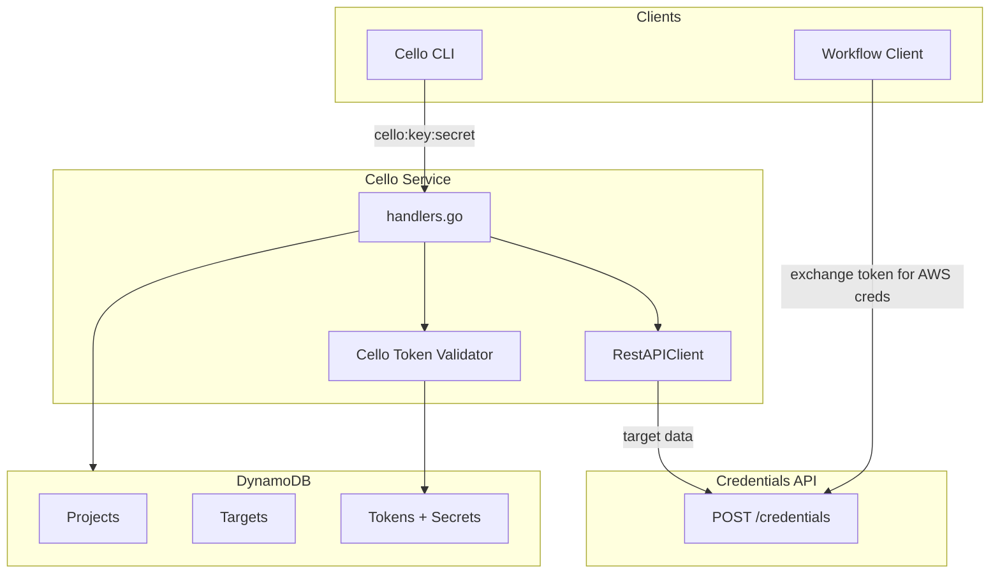
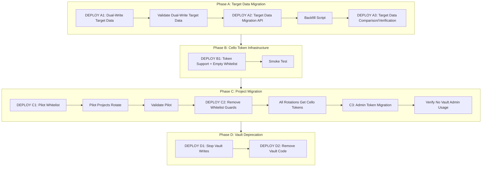

# Vault to REST API Migration Plan

## Overview

Replace Vault with a new REST API for AWS credential retrieval while moving project token management and target storage into the Cello service. Both providers run simultaneously, with per-project selection during the migration period.

## Architecture

### Current Architecture



### Migration Architecture



### Desired State Architecture



## Authorization Header Format

The authorization header maps to the `Authorization` format: `{Provider}:{Key}:{Secret}`

**Current:**

- `vault:admin:{admin_secret}` - Admin operations (Key="admin")
- `vault:{role_id}:{secret_id}` - Project operations (Key=Vault role_id)

**During Migration (both supported):**

- `vault:admin:{admin_secret}` - Admin (legacy)
- `vault:{role_id}:{secret_id}` - Project via Vault (legacy)
- `cello:admin:{admin_secret}` - Admin (new, Key="admin")
- `cello:{token_key}:{secret}` - Project via Cello-native auth (new, Key=token_key)

**Desired (after migration):**

- `cello:admin:{admin_secret}` - Admin only (Key="admin")
- `cello:{token_key}:{secret}` - Project via Cello-native auth only (Key=token_key)

**Summary of `auth.Key` values for cello provider:**

| Operation | `auth.Key` | `auth.Secret` |
|-----------|------------|---------------|
| Admin | `"admin"` | admin_secret |
| User/Project | `token_key` | token secret |

**`token_key` Format:**

The `token_key` (stored in `auth.Key` for user operations) is a composite value:

```
{project_id}_{ulid}
```

Example: `myproject_01HX5VG8YPQJK2NWRM4TCFD6B3`

When the service parses `token_key`, it splits on `_` to get:
- `project_id` → stored as `ProjectID` in DynamoDB, used for PK: `PROJECT#{project_id}`
- `ulid` → stored as `TokenID` in DynamoDB, used for SK: `TOKEN#{ulid}`

- ULID provides time-ordering and sufficient randomness
- **Clients treat the `token_key` as opaque** - only the service parses it

---

## Migration Phases



---

## Phase A: Target Data Migration

**Goal:** Get target data reliably into DynamoDB. NO token changes in this phase.

### Action Items for Phase A

#### A1: Add TargetEntry to DynamoDB

**File:** `service/internal/db/db.go`

**Task:** Add `TargetEntry` struct and CRUD operations.

**TargetEntry fields:**

- PK: `"PROJECT#{project_id}"`
- SK: `"TARGET#{target_name}"`
- TargetName, Type, CredentialType, RoleArn, PolicyArns, PolicyDocument
- CreatedAt, UpdatedAt (ISO-8601 timestamps)

**Functions to implement:**

- `CreateTargetEntry(ctx, projectID, entry) error`
- `DeleteTargetEntry(ctx, projectID, targetName) error`
- `ListTargetEntries(ctx, projectID) ([]TargetEntry, error)`
- `ReadTargetEntry(ctx, projectID, targetName) (TargetEntry, error)`
- `UpdateTargetEntry(ctx, projectID, entry) error`

**Tests:** Add tests in `service/internal/db/db_test.go`

---

#### A2: Implement Target Dual-Write in Handlers

**File:** `service/handlers.go`

**Task:** Modify target CRUD handlers to write to both Vault AND DynamoDB.

**Handlers to modify:**

- `createTarget` - Write to Vault, then write to DynamoDB (log DynamoDB errors, don't fail)
- `deleteTarget` - Delete from Vault, then delete from DynamoDB (log DynamoDB errors, don't fail)
- `updateTarget` - Write to Vault, then write to DynamoDB (log DynamoDB errors, don't fail)

**Behavior:**

- Vault write is primary - if it fails, request fails
- DynamoDB write is secondary - if it fails, log error but don't fail request
- This ensures zero production impact during rollout

**Pseudocode:**

```
createTarget handler:
    1. existing validation...
    2. write to Vault (existing code) - if error, fail request
    3. NEW: write to DynamoDB (dual-write)
       - if DynamoDB write fails, log warning but DON'T fail request
       - Vault write is primary during migration
    4. return success response
```

---

#### A3: Create Target Backfill Internal API

**File:** `service/handlers.go`

**Task:** Add internal API endpoint to copy a target from Vault to DynamoDB.

**Endpoint:** `POST /projects/{projectName}/targets/{targetName}/migrate`

**Pseudocode:**

```
migrateTarget handler:
    1. require admin auth (reject if not admin)
    2. read target from Vault using existing VaultProvider
    3. write target to DynamoDB
    4. return success JSON response

    Note: full error handling, logging, etc. in real implementation
```

**File:** `service/router.go`

**Task:** Add route for migration endpoint (follows existing route pattern). Mark as temporary.

**Usage:** Call this endpoint for each project/target to backfill via script

> **IMPORTANT:** This endpoint is temporary for migration only. It MUST be removed in Phase D (see D2 action item).

---

#### A4: Implement Target Read Verification

**File:** `service/handlers.go`

**Task:** Add verification that compares Vault and DynamoDB target data on reads.

**Handlers to modify:**

- `getTarget` - Read from Vault (source of truth), also read from DynamoDB, compare and log discrepancies
- `listTargets` - Read from Vault (source of truth), also read from DynamoDB, compare and log discrepancies

**Pseudocode:**

```
getTarget handler:
    1. read target from Vault (existing code) - this is source of truth
    2. NEW: also read target from DynamoDB
    3. compare Vault vs DynamoDB data
       - if mismatch, log ERROR with details (project, target, field differences)
       - if DynamoDB read fails, log warning but continue
    4. return Vault data to client (Vault still source of truth)
```

---

### Phase A Deployment Steps

| Step | Type          | Description                                                                                    |
| ---- | ------------- | ---------------------------------------------------------------------------------------------- |
| A1   | **DEPLOY A1** | Deploy dual-write code only. New target creates/updates/deletes go to both Vault AND DynamoDB. |
| A2   | Validate      | Confirm dual-write is working in production (check logs, verify DynamoDB entries).             |
| A3   | **DEPLOY A2** | Deploy internal migrate API endpoint (`/projects/{project}/targets/{target}/migrate`).         |
| A4   | Operational   | Call migrate endpoint for each existing target to backfill DynamoDB.                           |
| A5   | **DEPLOY A3** | Deploy read verification. Every target read compares Vault vs DynamoDB.                        |

**Exit criteria:** No discrepancies logged for extended period.

---

## Phase B: Cello Token Infrastructure

**Prerequisite:** The new REST API for credentials MUST be deployed and operational before proceeding with Phase B.

**Goal:** Deploy cello token capability with ZERO production impact (empty whitelist; so no projects actually using it).

### Action Items for Phase B

#### B1: Extend TokenEntry Schema

**File:** `service/internal/db/db.go`

**Task:** Add `HashedToken` field to `TokenEntry`.

**TokenEntry fields (additions):**

- HashedToken: bcrypt hash of secret (for cello tokens only)

---

#### B2: Update Authorization Validation

**File:** `service/internal/credentials/vault.go`

**Task:** Modify `Authorization.Validate()` to accept both `vault` and `cello` providers.

**Change:**

- Current: validates `provider == "vault"` only
- New: validates `provider == "vault" OR provider == "cello"`

---

#### B3: Implement Cello Token Creation

**File:** `service/handlers.go` (modify `createToken`)

**Task:** When a whitelisted project creates a token, generate a cello token instead of vault token.

**Token ID generation:**

- Format: `{project_id}_{ulid}`
- Use `github.com/oklog/ulid/v2` for ULID generation
- ULID provides time-ordering and 128-bit uniqueness

**Token secret generation:**

- Use `crypto/rand` for cryptographically secure random bytes (32 bytes / 256 bits)
- Base64 URL-encode the result

**Token hashing:**

- Use `bcrypt` with default cost (includes salt automatically)
- Store ONLY the hash in DynamoDB, never the raw secret

**Pseudocode:**

```
createToken handler:
    1. existing validation...
    2. check if project is in whitelist

    IF whitelisted:
        - generate ulid: ulid.Make()
        - generate token_key: "{project_id}_{ulid}"
        - generate secure random secret (crypto/rand, 32 bytes, base64url)
        - hash secret with bcrypt
        - store TokenEntry in DynamoDB:
          - ProjectID: project_id
          - TokenID: ulid
          - HashedToken: bcrypt hash of secret
          - CreatedAt, ExpiresAt: timestamps
        - return to client: "cello:{token_key}:{secret}"
          (token_key becomes auth.Key for future requests)

    ELSE (not whitelisted):
        - existing vault token creation flow
        - return vault token to client
```

---

#### B4: Implement Cello Token Validation

**File:** `service/handlers.go` (or new file)

**Task:** Add function to validate cello tokens via bcrypt against DynamoDB.

**Pseudocode:**

```
validateCelloAuth(ctx, auth Authorization):
    // auth.Key contains the token_key ("{project_id}_{ulid}") for user operations
    1. split auth.Key on "_":
       - project_id = first segment
       - ulid = second segment
    2. GetItem from DynamoDB:
       - PK: "PROJECT#{project_id}"
       - SK: "TOKEN#{ulid}"
    3. if not found, return error "invalid token"
    4. bcrypt.CompareHashAndPassword(tokenEntry.HashedToken, auth.Secret)
    5. if match, return valid=true with project_id
    6. if no match, return error "invalid token"
```

**Note:** This is O(1) lookup - single DynamoDB GetItem + single bcrypt comparison.

---

#### B5: Create RestAPIClient

**File:** `service/internal/credentials/restapi.go` (NEW)

**Task:** Create HTTP client for the new credentials API.

**RestAPIClient struct:**

- endpoint: base URL for credentials API
- serviceToken: admin token for authenticating to credentials API
- httpClient: standard HTTP client with timeout

**GetToken method pseudocode:**

```
GetToken(ctx, target) -> (credentialsToken, error):
    1. build JSON request body with target properties:
       - role_arn, credential_type, policy_arns, policy_document
    2. POST to {endpoint}/credentials
       - set Authorization header with service token
    3. parse response JSON to get token
    4. return token (or error with details)
```

---

#### B6: Add Environment Variables

**File:** `service/internal/env/env.go`

**Task:** Add new environment variables to Vars struct:

| Variable                         | Description                                         |
| -------------------------------- | --------------------------------------------------- |
| `CELLO_CREDENTIALS_API_ENDPOINT` | Base URL for new credentials API                    |
| `CELLO_CREDENTIALS_API_TOKEN`    | Service token for authenticating to credentials API |
| `CELLO_TOKEN_WHITELIST`          | Comma-separated project names that get cello tokens |

**File:** `service/main.go`

**Task:** Initialize RestAPIClient if endpoint is configured. Add to handler struct.

---

#### B7: Add Handler Routing

**File:** `service/handlers.go`

**Task:** Add explicit routing based on `auth.Provider` in workflow creation handlers.

**Pseudocode:**

```
createWorkflowFromRequest handler:
    switch auth.Provider:

    case "vault":
        - existing Vault flow unchanged
        - use VaultProvider to get credentials token
        - check project/target via Vault

    case "cello":
        // auth.Key is "admin" for admin ops, or token_key for user ops
        - if auth.Key == "admin", handle as admin (not applicable for workflows)
        - auth.Key contains the token_key ("{project_id}_{ulid}")
        - split auth.Key on "_" to get project_id and ulid
        - validate cello auth (bcrypt check against DynamoDB using project_id, ulid, and auth.Secret)
        - read target from DynamoDB using project_id
        - call RestAPIClient.GetToken(target) to get credentials token

    default:
        - return error "unsupported provider"

    ... rest of workflow creation using credentialsToken ...
```

**Note:** This is explicit routing - no abstraction layer. Both paths produce a `credentialsToken` that's used identically by the rest of the handler.

---

### Phase B Deployment Steps

| Step | Type          | Description                                                                       |
| ---- | ------------- | --------------------------------------------------------------------------------- |
| B1   | **DEPLOY B1** | Deploy all cello infrastructure. `CELLO_TOKEN_WHITELIST=""` (empty). Zero impact. |
| B2   | Validate      | Smoke test cello flow in test environment.                                        |

**Exit criteria:** Cello token flow works in test.

---

## Phase C: Project Migration

**Goal:** Migrate projects from vault to cello tokens, first via pilot whitelist, then by removing whitelist guards entirely.

### Phase C1: Pilot Migration

**Goal:** Validate cello token flow in production with a small set of pilot projects.

#### Deployment Steps

| Step | Type          | Description                                                          |
| ---- | ------------- | -------------------------------------------------------------------- |
| C1.1 | **DEPLOY**    | Set `CELLO_TOKEN_WHITELIST=proj1,proj2,...` with first 5-10 projects |
| C1.2 | Operational   | Whitelisted projects rotate tokens → receive cello tokens            |
| C1.3 | Validate      | Monitor workflows with cello tokens                                  |

**Exit criteria:** Pilot projects successfully using cello tokens with no issues.

---

### Phase C2: Remove Whitelist Guards

**Goal:** Enable all projects to receive cello tokens without manual whitelisting.

#### Action Items for Phase C2

##### C2.1: Remove Whitelist Check

**File:** `service/handlers.go` (modify `createToken`)

**Task:** Remove the whitelist check so all token rotations generate cello tokens.

**Change:**

- Current: Check if project is in `CELLO_TOKEN_WHITELIST` before generating cello token
- New: Always generate cello token regardless of project

**Pseudocode:**

```
createToken handler:
    1. existing validation...
    2. REMOVED: check if project is in whitelist

    // Always generate cello token (whitelist check removed)
    - generate ulid: ulid.Make()
    - generate token_key: "{project_id}_{ulid}"
    - generate secure random secret (crypto/rand, 32 bytes, base64url)
    - hash secret with bcrypt
    - store TokenEntry in DynamoDB
    - return to client: "cello:{token_key}:{secret}"
```

**Note:** Existing vault tokens continue to work until rotated. The `vault:` auth path remains active to support projects that haven't rotated yet.

#### Deployment Steps

| Step | Type          | Description                                                              |
| ---- | ------------- | ------------------------------------------------------------------------ |
| C2.1 | **DEPLOY**    | Remove whitelist check - all new token rotations receive cello tokens    |
| C2.2 | Operational   | Rotate rest of projects |

**Exit criteria:** All projects rotated to cello tokens.

---

### Phase C3: Admin Token Migration

**Goal:** Migrate all admin clients from `vault:admin:{secret}` to `cello:admin:{secret}` while both providers are supported.

#### Action Items for Phase C3

##### C3.1: Admin Client Migration

**Task:** Admin users update their clients/scripts to use `cello:admin:...` instead of `vault:admin:...`.

**Changes required:**

- Update any scripts or automation using admin tokens
- Update any CI/CD pipelines using admin tokens
- Update any manual tooling or documentation referencing admin tokens

**Note:** This is a client-side change only - no service deployment required. The service already accepts both `vault:admin:...` and `cello:admin:...` (enabled in Phase B2).

---

##### C3.2: Verify No Vault Admin Usage

**Task:** Monitor logs to confirm no clients are still using `vault:admin:...`.

**Verification:**

- Check service logs for `vault:admin:...` authentication attempts
- Confirm all admin operations are using `cello:admin:...`
- This validation MUST pass before proceeding to Phase D

---

#### Deployment Steps

| Step | Type          | Description                                                              |
| ---- | ------------- | ------------------------------------------------------------------------ |
| C3.1 | Operational   | Admin users update clients to use `cello:admin:{secret}`                 |
| C3.2 | Validate      | Confirm no `vault:admin:...` usage in logs before proceeding to Phase D  |

**Exit criteria:** All admin clients using `cello:admin:...`, zero `vault:admin:...` requests observed.

---

## Phase D: Vault Deprecation

**Prerequisite:** Phase C3 complete - all admin clients migrated to cello provider, projects using only cello tokens

**Goal:** Remove Vault dependency entirely.

### Action Items for Phase D

#### D1: Stop Vault Target Writes

**File:** `service/handlers.go`

**Task:** Remove Vault writes for targets, keep only DynamoDB.

#### D2: Remove Vault Code

**Files to modify:**

- `service/handlers.go` - Remove `vault:` auth path, remove `migrateTarget` handler
- `service/router.go` - Remove `/projects/{projectName}/targets/{targetName}/migrate` route
- `service/internal/credentials/vault.go` - Remove VaultProvider (or keep for reference)
- `service/internal/env/env.go` - Remove Vault env vars from required
- `service/main.go` - Remove Vault initialization

#### D3: Cleanup

- Remove Vault AppRoles
- Remove Vault AWS roles
- Remove Vault policies
- Remove `CELLO_TOKEN_WHITELIST` env var

### Deployment Steps

| Step | Type          | Description                 |
| ---- | ------------- | --------------------------- |
| D1   | **DEPLOY D1** | Stop Vault target writes    |
| D2   | **DEPLOY D2** | Remove all Vault code       |
| D3   | Cleanup       | Remove Vault infrastructure |

---

## Design Decisions

1. **Cello token secret format:**
   - Cryptographically secure random bytes (32 bytes via `crypto/rand`)
   - NOT a UUID (insufficient entropy)
   - Store ONLY bcrypt hash in DynamoDB
   - bcrypt includes salt automatically

2. **Whitelist storage:**
   - Environment variable: `CELLO_TOKEN_WHITELIST=proj1,proj2`
   - NOT in DynamoDB - temporary during pilot phase only
   - Used only for Phase C1 (pilot); removed in Phase C2 when guards are dropped

3. **Admin auth:**
   - Accept both `vault:admin:...` and `cello:admin:...` during migration
   - Only `cello:admin:...` after vault cleanup

4. **Token rotation strategy:**
   - Phase C1 (pilot): Whitelisted projects get cello tokens; others get vault tokens
   - Phase C2 (post-whitelist): ALL projects get cello tokens on rotation
   - Existing vault tokens continue working until rotated

5. **`token_key` format (stored in `auth.Key` for user ops):**
   - Format: `{project_id}_{ulid}`
   - Example: `myproject_01HX5VG8YPQJK2NWRM4TCFD6B3`
   - ProjectID embedded for efficient DynamoDB lookup (no GSI needed)
   - Service splits on `_` to get `project_id` and `ulid` separately
   - DynamoDB stores: `ProjectID` = project_id, `TokenID` = ulid (not the full token_key)
   - **Clients/CLI treat `token_key` as opaque** - they store and send it as-is
   - ULID chosen over UUID v4/v7 for:
     - Time-ordering (tokens naturally sort by creation time)
     - Compact representation (26 chars vs 36 for UUID)
     - Sufficient entropy (80 random bits)
   - Use `github.com/oklog/ulid/v2` Go library

---

## Task List

### Phase A: Target Data Migration

- [ ] **A1:** Add TargetEntry struct and CRUD operations to DynamoDB
- [ ] **A2:** Implement dual-write for targets (Vault + DynamoDB)
- [ ] **A3:** Create internal target migration API endpoint
- [ ] **A4:** Implement target read verification (compare Vault vs DynamoDB)

### Phase B: Cello Token Infrastructure

- [ ] **B1:** Extend TokenEntry schema with HashedToken field
- [ ] **B2:** Update Authorization validation to accept both vault and cello providers
- [ ] **B3:** Implement cello token creation for whitelisted projects
- [ ] **B4:** Implement cello token validation via bcrypt
- [ ] **B5:** Create RestAPIClient for new credentials API
- [ ] **B6:** Add environment variables for credentials API and whitelist
- [ ] **B7:** Add handler routing based on auth provider

### Phase C: Project Migration

- [ ] **C2.1:** Remove whitelist check from token creation
- [ ] **C3.1:** Migrate admin clients to cello provider
- [ ] **C3.2:** Verify no vault admin usage in logs

### Phase D: Vault Deprecation

- [ ] **D1:** Stop Vault target writes
- [ ] **D2:** Remove Vault code and migration endpoint
- [ ] **D3:** Cleanup Vault infrastructure